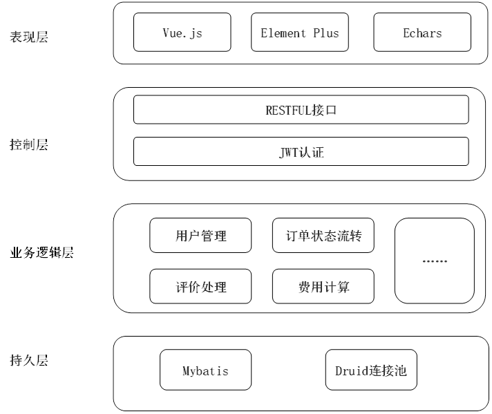
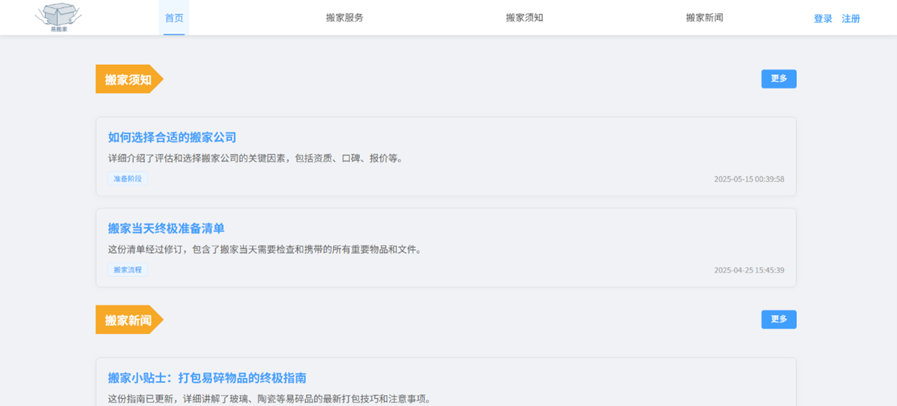
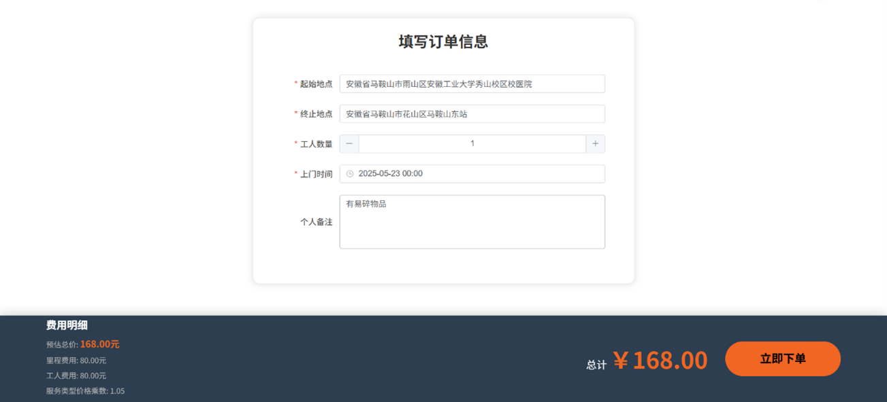
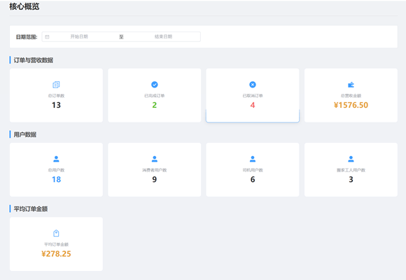
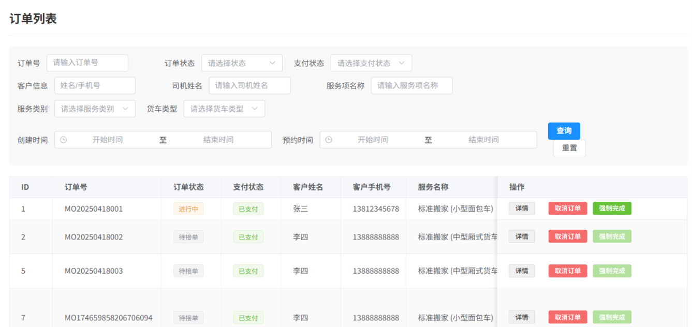
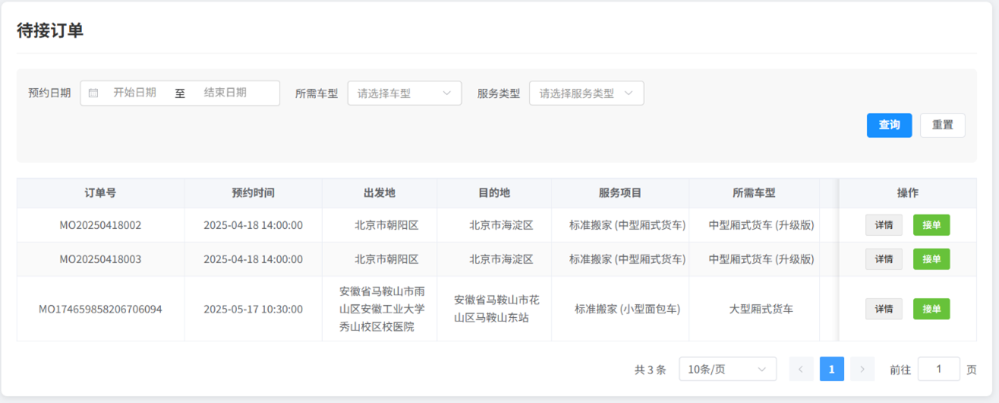
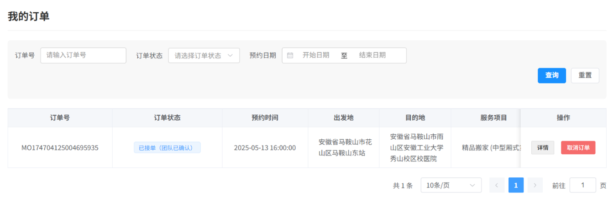

# RelocateWeb - 基于 SpringBoot + Vue 的搬家服务管理系统

[](https://vuejs.org/)[](https://spring.io/projects/spring-boot)[](https://www.mysql.com/)[](https://opensource.org/licenses/MIT)

## 📖 项目简介

**RelocateWeb** 是一个现代化、全流程的在线搬家服务管理平台。本项目基于主流的 **SpringBoot + Vue** 前后端分离架构，构建了一个包含 **后端API服务**、**前端用户端** 和 **前端管理端** 的三端分离系统。它针对传统搬家行业服务流程不规范、价格不透明、信息不对称等痛点，旨在整合客户下单、服务跟踪、费用计算等核心功能，连接消费者、司机、搬家工人和平台管理员，打造一个高效的协同网络。

该系统不仅作为一项毕业设计成果，更是一个功能完备、可部署、可扩展的真实业务解决方案，致力于推动传统搬家服务行业的数字化转型。

## ✨ 项目创新点

-   **全流程数字化闭环管理**：打破传统模式下各环节信息割裂的状态，构建从需求发布、在线估价、订单分配、服务执行到完成评价的端到端数字化闭环，实现服务全程透明化管控。
-   **智能透明的计价模型**：开发基于多维度参数（如距离、车型、所需工人数）的动态计费系统，通过标准化算法实时预估并公开费用明细，有效减少价格争议，增强用户信任。
-   **基于角色的细粒度权限控制 (RBAC)**：为不同用户（消费者、司机、搬家工人、管理员）精确分配操作权限，保障业务流程的规范性，有效防范数据越权访问风险。
-   **可视化数据看板**：为平台管理员提供动态的数据看板，直观展示订单量、营收趋势、用户增长等核心运营指标，为运营决策提供有力的数据支持。

## 🚀 技术栈

### 后端 (Backend)

| 技术             | 说明                       |
| ---------------- | -------------------------- |
| **Spring Boot**  | 核心框架                   |
| **MyBatis**      | ORM 框架                   |
| **MySQL**        | 关系型数据库               |
| **Redis**        | 内存数据库，用于缓存       |
| **JWT (jjwt)**   | 用户认证与授权             |
| **Druid**        | 数据库连接池               |
| **PageHelper**   | MyBatis 分页插件           |
| **Spring Mail**  | 邮件服务                   |

### 前端 (Frontend)

| 技术              | 说明                     |
| ----------------- | ------------------------ |
| **Vue 3**         | 核心 MVVM 框架           |
| **Vite**          | 下一代前端构建工具       |
| **Vue Router**    | 官方路由管理器           |
| **Pinia**         | 状态管理库               |
| **Element Plus**  | Vue 3 UI 组件库          |
| **ECharts**       | 数据可视化图表库         |
| **Axios**         | HTTP 请求库              |

## 🏛️ 系统架构

本系统采用经典且成熟的前后端分离分层架构。前端项目包含两个独立的应用：**用户端** 和 **管理端**。这种设计确保了系统的高内聚、低耦合，为未来的维护与扩展奠定了良好基础。




## 📦 主要功能模块

系统前端分为 **用户端** 和 **管理端** 两大独立应用，后端为所有前端提供统一的API服务。系统共包含四种核心角色：**用户（消费者）**、**司机**、**搬家工人** 和 **管理员**。

### 👤 用户端 (面向消费者)

-   **服务浏览与估价**：在线查看各类搬家服务详情，输入信息实时估算费用。
-   **在线下单与支付**：便捷填写订单信息，选择支付方式完成下单。
-   **订单全周期管理**：实时跟踪订单状态，查看历史订单，管理个人信息。
-   **服务评价体系**：对已完成的服务进行多维度评价。

### ⚙️ 管理端 (面向管理员、司机、搬家工人)

管理端为不同角色提供差异化的功能视图和操作权限。

-   **管理员 (Admin)**:
    -   **数据驾驶舱 (Dashboard)**：核心运营数据可视化，支持多维度分析与趋势预测。
    -   **全方位订单管理**：监控平台所有订单，具备查询、详情查看、人工干预（取消/强制完成）等权限。
    -   **多角色用户管理**：对平台内所有类型的用户账户进行生命周期管理。
    -   **服务与资源配置**：动态管理服务类型、服务项、车辆类型及人员资质等核心业务数据。
    -   **平台内容管理**：发布和维护搬家新闻、搬家须知等公告信息。
-   **服务提供者 (司机 & 搬家工人)**:
    -   **订单广场**：在待接订单池中发现并承接新任务。
    -   **个人任务中心**：管理进行中的订单，更新服务状态（开始/完成服务）。
    -   **历史订单追溯**：查询已完成或已取消的历史订单记录。
    -   **评价反馈**：查看客户对自身服务的评价，持续改进。

## 🖼️ 系统界面截图

### 用户端界面
<div align="center">
  
  <p><em>消费者系统首页</em></p>
</div>
<div align="center">
  
  <p><em>填写订单信息页</em></p>
</div>

### 管理端界面
<div align="center">
  
  <p><em>后台数据统计与可视化核心概览页 (管理员视图)</em></p>
</div>
<div align="center">
  
  <p><em>管理员订单管理列表页 (管理员视图)</em></p>
</div>
<div align="center">
  
  <p><em>司机待接订单页 (司机视图)</em></p>
</div>
<div align="center">
  
  <p><em>搬家工人我的订单页 (搬家工视图)</em></p>
</div>


## ⚡ 快速开始

### 1. 环境准备
-   JDK 1.8+
-   Maven 3.6+
-   Node.js 16+
-   MySQL 8.0+
-   Redis

### 2. 后端启动
1.  克隆项目到本地。
2.  在 MySQL 中创建数据库，并导入项目 `sql/` 目录下的初始化脚本。
3.  **配置后端服务 (重要)**:
    -   **获取外部服务密钥**:
        -   **邮箱授权码**: 登录您的邮箱（如QQ邮箱），在设置中开启SMTP服务并获取一个**授权码**（注意：这不是您的邮箱登录密码）。
        -   **百度地图AK**: 访问[百度地图开放平台](https://lbsyun.baidu.com/)，注册并创建一个应用，获取服务端类型的API密钥（AK）。
    -   **创建本地配置文件**:
        -   在 `background/src/main/resources/` 目录下，找到名为 `application-example.yml` 的模板文件。
        -   **复制** 该文件并将其重命名为 `application-local.yml`。
        -   打开您刚刚创建的 `application-local.yml`，根据提示填入以下**必要信息**：
            ```yaml
            spring:
              datasource:
                # 替换为您的数据库用户名
                username: <你的数据库用户名>
                # 替换为您的数据库密码
                password: <你的数据库密码>
              mail:
                # 替换为您的邮箱账户
                username: <你的邮箱账户>
                # 替换为您的邮箱授权码
                password: <你的邮箱授权码>
            relocate:
              jwt:
                # 建议将密钥更改为长且随机的字符串
                back-secret-key: <你的后端JWT密钥>
                front-secret-key: <你的前端JWT密钥>
              baidu:
                # 替换为您的百度地图AK
                ak: <你的百度地图AK>
            ```
    -   **激活本地配置**:
        -   打开 `background/src/main/resources/application.yml` 文件。
        -   将 `spring.profiles.active` 的值修改为 `local`。
4.  使用 IDE (如 IntelliJ IDEA) 启动 `background` 模块下的 `BackgroundApplication.java`。

### 3. 前端启动
1.  进入 `frontground` 目录。
2.  安装依赖: `npm install`
3.  启动开发服务器: `npm run dev`
4.  浏览器访问 Vite 提供的本地地址。
    -   **用户端**: `http://localhost:5173/login`
    -   **管理端**: `http://localhost:5173/admin/login`

## 业务流程核心：订单状态

系统的核心业务逻辑围绕订单的生命周期展开，状态流转清晰明确。其主要流程如下：

1.  **待接单**: 用户下单并支付后，订单进入此状态。
    -   `->` **司机已接单** (司机接单)
    -   `->` **已取消** (用户或管理员在服务开始前取消)

2.  **司机已接单**: 司机已接受订单，等待所需搬运工加入。
    -   `->` **已接单** (订单所需的搬运工全部到位)
    -   `->` **待接单** (司机因故取消接单，订单返回待接单池)
    -   `->` **已取消** (用户或管理员取消)

3.  **已接单**: 司机和搬运工团队已组建完成，准备开始服务。
    -   `->` **进行中** (司机或团队代表点击“开始服务”)
    -   `->` **司机已接单** (有搬运工退出，导致团队不完整)
    -   `->` **已取消** (用户或管理员取消)

4.  **进行中**: 搬家服务正在进行。
    -   `->` **已完成** (司机或团队代表点击“完成服务”)
    -   `->` **已取消** (特殊情况下管理员介入取消)

5.  **已完成**: 服务流程结束，等待用户评价。

6.  **已取消**: 订单被取消，流程终止。

## 🤝 贡献

欢迎对本项目提出改进意见，你可以通过以下方式贡献：
-   提交 Issue
-   发起 Pull Request

## 📄 License

本项目采用 [MIT License](https://opensource.org/licenses/MIT) 开源。
